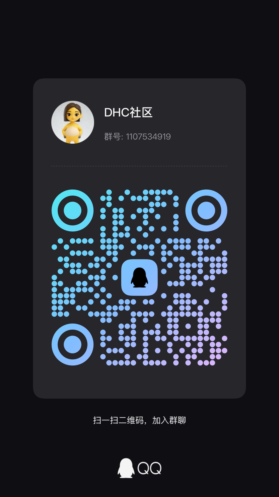

<div align="center">
  
  <h1>DeepSeek Harness Code</h1>
  <h3>Born for Code — The Code-Engineering Specialization of DeepSeek Harness</h3>
  <p>A deep specialization of DeepSeek Harness for code generation, project refactoring, and engineering debugging.</p>
  <p><a href="./README.md">English</a> · <a href="./README.zh-CN.md">简体中文</a></p>
  <p><a href="#forged-for-code-a-deeply-specialized-coding-agent">Specialized Agent</a> · <a href="#integration-philosophy">Integration Philosophy</a> · <a href="#architecture">Architecture</a> · <a href="#beyond-a-web-wrapper">Why Not a Wrapper</a> · <a href="#built-for-long-running-work">Long-Running</a> · <a href="#build-from-source">Build</a></p>
  <p>
    
    
    
    
    
  </p>
  <p>
    
    
    
  </p>
</div>

> [!IMPORTANT]
> DeepSeek Harness Code is a community project. It is not an official DeepSeek release and is not affiliated with DeepSeek.

> Born for Code — The Code Engineering Specialized Version of DeepSeek Harness.

---

## Forged for Code: A Deeply Specialized Coding Agent

General agents handle broad daily tasks well, but stumble in complex software engineering — lacking understanding of project context, file trees, and build chains.

**DeepSeek Harness Code** is built to solve exactly that. As a dedicated specialization branch of DeepSeek Harness, it channels the model's reasoning strength into high-quality software code — from single-file edits to multi-module collaborative refactoring, with end-to-end engineering support. Broad agents suffer from generic tool scheduling and vague context management; code engineering is a rigorous deterministic art. We strip the baggage of generic scenarios and deeply bind reasoning to real software environments (AST parsing, terminal, code sandbox, Diff editing) — delivering straight to the engineering essence.

### Why specialization?

- **Precise engineering context** — deep code indexing and file-dependency awareness, no more lost context.
- **Native terminal & Diff** — not plain text output, but canonical Patches with sandboxed test execution.
- **Minimal integration cost** — out of the box, directly embeddable into existing editors and CLI workflows.

## Integration Philosophy

We don't chase boundless complexity. We adhere to a code-tailored engineering philosophy:

1. **Scenario Specialized** — Focus on the code lifecycle, cut every bloated design unrelated to programming.
2. **Modular Decoupling** — Scheduler and toolchain decoupled, freely pluggable with custom LSP, Linter, and sandbox.
3. **Deterministic Delivery** — Test- and verification-driven, replacing model hallucination with real execution results.
4. **Controllable & Traceable** — Full change logs and rollback, ensuring every modification is safe and transparent.

> DHC remains a community project built on the official Harness format and runtime. No model weights are bundled, no provider boundary is replaced — users never need to assemble a fragile toolchain by hand.

## QQ community

Join the DHC community QQ group to share feedback, usage tips, and project discussions.

- **QQ group:** `1107534919`

<p>
  
</p>

## One complete DeepSeek Harness distribution

A complete, coherent Harness distribution — not a model launcher or plugin collection. The official Base and Web bundles bring the core of the DeepSeek Agent stack into one app:

- **Models & reasoning** — V4 Pro / V4 Flash catalog, reasoning effort `off` / `high` / `max`, 1M context, retry and streaming.
- **Skills** — runtime, file discovery, Skills UI, badges, and official Skill tool.
- **Agent workflow** — Standard presets, Goal / Plan / Todo / Jobs / Workflow, compaction, checkpoints, and persistent sessions.
- **Tools** — file read/search/edit, Bash / PowerShell, Web, user questions, approvals, subagents, feedback, and deliverables.
- **Plugin platform** — official plugin inventory plus integrated desktop and Anchored Standard bundles.
- **Desktop reliability** — native lifecycle, secure bridge, health recovery, rotating diagnostics, and independent Watchdog.

Everything is pinned, packaged, and validated as one product boundary.

## Modernizing the BETA1 experience

BETA1 provides the foundation, but early Web experience leaves key problems to the user. DHC builds a modern application layer:

- **Long-session memory** — bound desktop growth paths, rotate diagnostics, prevent overlapping recovery, retire superseded processes.
- **Web freezes** — detect persistently unresponsive renderer, replace window without destroying healthy Harness.
- **Fragile lifecycle** — own startup, readiness, serialized restart, bounded shutdown, port retry, and session-aware recovery.
- **Scattered capabilities** — ship runtime, plugins, Skills, tools, workflows, questions, approvals, and extensions as one tested package.
- **Desktop gaps** — add native menus, tray, close preferences, system appearance, shortcuts, transitions, settings, and accessible diagnostics.

The goal is not to fork the protocol, but to make the experience more complete, modern, and reliable while preserving the official Harness model.

## A more complete V4 Pro experience

V4 Pro is one important capability of this integrated foundation, not its sole center. The pinned adapter publishes `deepseek-v4-pro` / `deepseek-v4-flash` with `off` / `high` / `max` reasoning. The app bundles integration and runtime — not model weights; credentials stay in official Harness settings.

### Tool-surface anchoring

The next step is not a keyword to "turn on reasoning," but controlling the first-request tool surface to preserve the high-quality trajectory V4 Pro is capable of.

- **Standard**: 25 tools visible upfront, easy to fall into inefficient `Let me...`, Project2 ~9,192.
- **Minimal**: only Shell + Read, more likely to recover `We need...`, Project2 ~9,699.

`dsh-anchored-standard` solves this with **first-request anchoring + dynamic promotion**: expose only `bash` + `str_replace_editor` first, unlock the full 25 tools after the first durable call. Consecutive **98 / 99** on native Windows Project2.

> [!NOTE]
> `off` / `high` / `max` are official; anchoring only changes the tool catalog exposed across phases, not private fields or hidden CoT.

## Beyond a Web wrapper

| Capability          | Basic Web wrapper      | DeepSeek Harness Code                                             |
| ------------------- | ---------------------- | ----------------------------------------------------------------- |
| Runtime             | Loads a remote page    | Bundled Chromium + official Harness + plugins, auto-detected Node |
| Model integration   | Inherits page models   | First-class V4 Pro / Flash catalog and reasoning controls         |
| Agent toolkit       | None                   | Plugins, Skills, Goal / Plan / Workflow, questions, subagents     |
| Process ownership   | Page is the product    | Desktop host owns Harness startup, readiness, restart, shutdown   |
| Long-session health | Manual refresh         | Non-overlapping health probes and evidence-based recovery         |
| Web freeze          | Reload entire app      | Detect unresponsive renderer, rebuild window, keep Harness alive  |
| Service failure     | Noticed after UI stops | Auto-recover after consecutive probe failures or child exit       |
| Desktop crash       | No independent layer   | IPC-only Watchdog with bounded backoff and circuit breaker        |
| Memory pressure     | Inherits unbounded     | Bounds growth paths, rotates logs, retires failed processes       |
| Diagnostics         | Browser console only   | Redacted Electron / Harness / Watchdog logs, in-app access        |
| Desktop integration | Window chrome only     | Native tray/menu, close policy, system theme, shortcuts           |
| Security boundary   | Broad preload access   | Loopback-only Harness + two validated preload groups              |
| Distribution        | Requires external env  | Self-contained app, auto-detected common install locations        |

> Lightweight wrappers solve "open this site like an app"; DHC solves "operate Harness as a resilient desktop coding system."

## Built for long-running work

Long sessions rarely crash dramatically — pressure accumulates: renderer stalls, child exits, checks overlap, logs grow unbounded, zombie processes linger.

- **Health monitoring** — single probe every 5s, serialized recovery after 3 consecutive failures or child exit.
- **Renderer recovery** — must stay unresponsive for 30s before window rebuild; responsive event cancels, healthy Harness stays alive.
- **Watchdog** — bounded 1s / 2s restart after abnormal disconnect; 3rd crash within 5 minutes opens circuit.
- **Bounded shutdown** — handshake with Watchdog, request Harness graceful termination, wait up to 8s before escalation.
- **Bounded diagnostics** — redacted, rotated 5×10 MB, not forever.
- **No overlapping recovery** — concurrent failures converge to one operation.
- **No blind replay** — healthy service is never killed, interrupted requests are never auto-replayed.

## Modern desktop experience

- **Self-contained host, system Node** — Chromium / Harness / plugins / Watchdog bundled in .app, running on system Node ≥22.13, installed to user data on first launch, auto-detected even under minimal GUI PATH.
- **Official Harness surface** — sessions, profiles, providers, workspace, and question flows remain official.
- **Integrated settings** — runtime status, restart, logs, and close behavior in General settings with official UI primitives.
- **Native lifecycle** — open, restart, logs, and quit from persistent tray/menu; close-to-tray or direct quit.
- **System appearance** — light/dark startup UI, platform title bar, official monochrome assets, reduced-motion support.
- **Smooth navigation** — View Transitions when available, CSS fallback otherwise, no forced layout.
- **Workspace resilience** — validated Standard switching and official session restoration.
- **Opt-in LAN access** — disabled by default; when enabled, an Electron-owned HTTP proxy exchanges a one-time link token for an HttpOnly cookie and serves a trusted LAN while Harness and the desktop renderer stay on loopback.
- **Skills** — Superpowers 6.2.0 installed to `<DSH_HOME>/skills`, never overwriting user-owned directories.
- **Global Agent Protocol** — `<DSH_HOME>/AGENTS.md`: auto-installed when absent, upgraded only while still app-managed, never overwriting user-owned, with timestamped backup switch via `Use Bundled Global Prompt…`.
- **Global `dsh`** — `npm install -g` of pinned `@deepseek-ai/dsh` on first launch, never overwriting user global, fail-open.
- **Localized presets** — `anchored-standard` / `router-standard` / `router-spec` with bilingual names, IDs unchanged.
- **Safe experiment** — Anchored Standard as separate bundle, fails closed to Standard on rc.8.

## Feature matrix

| Area          | Included                                                 |
| ------------- | -------------------------------------------------------- |
| Desktop host  | Hardened window, startup page, native menus, tray        |
| Harness       | Pinned `@deepseek-ai/dsh` rc.8, loopback, single Home    |
| V4 models     | Official catalog and `off` / `high` / `max`              |
| Stack         | Skills, Goal / Plan / Workflow / Todo / Jobs / questions |
| Skills        | Superpowers 6.2.0, never overwriting user                |
| Global prompt | `AGENTS.md` ownership-safe install and backup switch     |
| Global CLI    | Pinned `dsh` via `npm install -g`                        |
| Presets       | Standard default, optional anchored / router             |
| Recovery      | Health probes, restart, renderer replacement, port retry |
| Watchdog      | Independent IPC, bounded restart and circuit breaker     |
| Plugins       | Desktop, UI Motion, Model2, Find, Routing, etc.          |
| Diagnostics   | Startup evidence, runtime state, redacted rotated logs   |
| Security      | Sandboxed renderer, no Node integration, validated IPC   |
| Packaging     | macOS Universal DMG; Windows NSIS; Linux AppImage/deb    |

## Routing suite

Bundled community [dsh-routing-suite](https://github.com/yjh051108/dsh-routing-suite), auto-loaded on every launch:

- **Offline snapshot** — three pinned components (`@dsh-external/dsh-super-injector`, `@dsh-external/dsh-mode-boost`, `router-standard` + `router-spec`) inside app resources.
- **Pinned baseline** — `injector 0.3.3` / `mode-boost 0.1.0` / `router-preset 0.2.0@eff787e`, SHA-256 in `build/routing-suite/versions.json`.
- **Official install** — via system Node + bundled pnpm `dsh plugin --profile web add` (desktop, ui-motion, model2, prompt-principles, vision-router, better-sidebar, LAN access, composition, Super Injector, Mode Boost, find-plugin). Harness owns normal manifest reconciliation; the desktop host's only compatibility edit removes the two rc.8 `linkOnly` subagent bundle names after a successful CLI reconcile and never alters unrelated entries. A validated app-owned reconciliation marker skips repeated CLI additions only for an unchanged managed roster; a missing or mismatched marker, changed package root/identity, missing profile dependency, or foreign store runs the official reconciliation again. Corrupted `node_modules` self-reference is rebuilt once.
- **Reviewed updates** — only with new app release, SHA-256 verified before extraction, never downloading mutable code in background.
- **Ownership-safe** — never overwrites unrelated plugins or user-owned presets, legacy Home copy-only migrated.

## Architecture

<p align="center">
  
  <br />
  <em>Figure 1 — Code Agent desktop architecture. Electron Main owns window/child/bridge; Harness owns sessions/protocol; Watchdog owns relaunch; Preload owns validation. See <a href="./docs/architecture/overview.md">overview</a> and <a href="./docs/architecture/lifecycle.md">lifecycle</a>. Chinese: <a href="./docs/architecture/system-zh.svg">system-zh.svg</a></em>
</p>

In one picture: host creates window, resolves system Node, reconciles plugins via public CLI, starts `dsh web` on loopback and health-checks with non-overlapping 5s probes; Preload is the only renderer↔main seam (`preferences`, `lanAccess`, `runtime`, `updater`, `bundledPlugins`); BrowserWindow hosts official Harness Web and workbench; Harness child runs the full Agent runtime on `127.0.0.1` official Home; intelligence plane shapes tool surface and knowledge; Watchdog restarts via IPC with bounded backoff; persistence stays outside `.app`.

Full boundaries in [overview](./docs/architecture/overview.md) and [lifecycle](./docs/architecture/lifecycle.md), light/dark adaptive.

## Security model

- Sandboxed renderer, no Node integration.
- Only the fixed `preferences`, `lanAccess`, `runtime`, `updater`, and `bundledPlugins` preload groups.
- IPC payloads validated before desktop actions.
- Harness itself binds only to loopback. LAN access is disabled by default; an opt-in Electron reverse proxy may listen on `0.0.0.0`, exchange its one-time link token for an HttpOnly cookie, and forward authenticated traffic to loopback. It is trusted-LAN HTTP only, with no Internet-exposure or TLS claim.
- Credentials stay in official Harness settings, never in bundle.
- Logs exclude credentials, Authorization, Cookie, prompts, and responses.
- External navigation `allow` / `open-external` policy.

## Platform status

| Platform | Target                             | BETA2-2 release status                      |
| -------- | ---------------------------------- | ------------------------------------------- |
| macOS    | macOS 12+, Intel and Apple Silicon | Universal package validation pending tag CI |
| Windows  | Windows 10+, x64 and arm64         | Native package validation pending tag CI    |
| Linux    | x64 and arm64                      | Native package validation pending tag CI    |

Cross-platform definitions are checked in; BETA2-2 is pending validation and release. Only native-runner-verified artifacts from the corresponding tag CI are considered released.

## Install on macOS

Current package is unsigned. After copying `DeepSeek Harness Code.app` to `/Applications`, a trusting recipient may remove quarantine for this app only:

```bash
xattr -dr com.apple.quarantine "/Applications/DeepSeek Harness Code.app"
```

Do not disable Gatekeeper globally. See [complete unsigned guide](./docs/operations/install-unsigned.md).

## Build from source

### Requirements

- Node.js ≥22.13 (toolchain and runtime)
- pnpm 11.19.0 (via pinned command below)
- Platform-native packaging tools

```bash
git clone https://github.com/Code-DSH/deepseek-harness-code.git
cd deepseek-harness-code
npm exec --yes --package=pnpm@11.19.0 -- pnpm install --frozen-lockfile
npm exec --yes --package=pnpm@11.19.0 -- pnpm test
```

Build and launch:

```bash
npm exec --yes --package=pnpm@11.19.0 -- pnpm start
```

Packages:

```bash
npm exec --yes --package=pnpm@11.19.0 -- pnpm dist:mac
npm exec --yes --package=pnpm@11.19.0 -- pnpm dist:win
npm exec --yes --package=pnpm@11.19.0 -- pnpm dist:linux
```

> Release packages and `update-manifest.json` are produced by GitHub Actions only after verification on a `v*` tag push; local `dist:*` is for verification only.

## Verify

```bash
npm exec --yes --package=pnpm@11.19.0 -- pnpm build
npm exec --yes --package=pnpm@11.19.0 -- pnpm test
npm exec --yes --package=pnpm@11.19.0 -- pnpm check
npm exec --yes --package=pnpm@11.19.0 -- pnpm check:memory
node scripts/verify-macos-artifact.mjs release/DeepSeek-Harness-Code-*.dmg --universal
```

## Documentation

- [Project intent](./docs/project/intent.md)
- [Architecture overview](./docs/architecture/overview.md) / [Lifecycle](./docs/architecture/lifecycle.md)
- [Diagram (EN)](./docs/architecture/system.svg) · [架构图（中文）](./docs/architecture/system-zh.svg)
- [Testing strategy](./docs/engineering/testing.md) / [Acceptance](./docs/engineering/acceptance-report.md)
- [Troubleshooting](./docs/operations/troubleshooting.md) / [Unsigned install](./docs/operations/install-unsigned.md)

## Roadmap

- Reproducible durability benchmarks (5s probe / 30s renderer / 8s shutdown).
- Native Linux GA (AppImage/deb already CI-green).
- Paired Project2 validation for anchored tool surface.
- Non-replaying fault injection.
- Versioned, Skills-driven delivery.
- Upstream plugin API tracking behind pinned rc.8 + SHA-256.

## Contributing

Issues and PRs welcome. Runtime behavior changes should include focused tests and update canonical docs. Keep claims evidence-based; never attach keys, cookies, prompts, or responses.

Start with [AGENTS.md](./AGENTS.md) and [documentation index](./docs/index.md).

## License

MIT License.

## Acknowledgements

Built on the official [DeepSeek Harness](https://github.com/deepseek-ai/deepseek-harness) and Electron. DeepSeek created the foundation; this community project focuses on desktop lifecycle, integration, recovery, packaging, and long-running Code Agent usability.

## Disclaimer

Community-maintained software. "DeepSeek" only identifies compatibility with upstream; no affiliation, endorsement, or official support is implied.
