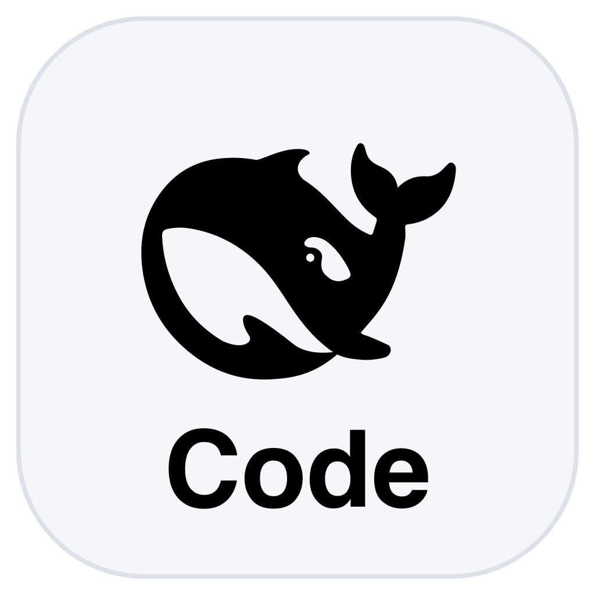
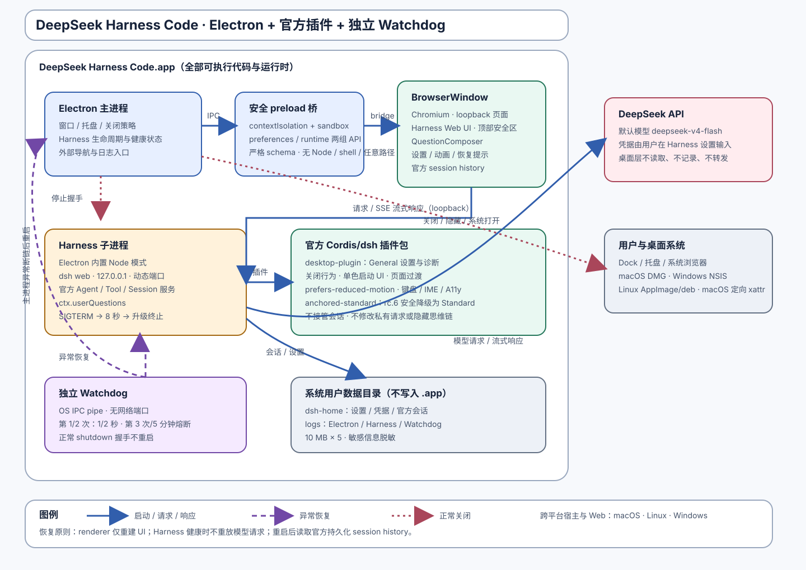

<div align="center">
  
  <h1>DeepSeek Harness Code</h1>
  <h3>The complete, modern DeepSeek Harness assembled desktop integration distribution — users should not have to assemble a fragile toolchain themselves; Official Harness provides the building blocks, DHC provides the assembled product.</h3>
  <p>DeepSeek Harness Code brings the full Harness runtime, plugins, Skills, tools, agent workflows, a hardened desktop host, and an independent Watchdog together in one integrated package.</p>
  <p><a href="./README.md">English</a> · <a href="./README.zh-CN.md">简体中文</a></p>
  <p><a href="#the-dhc-integration-philosophy">Integration philosophy</a> · <a href="#vision">Vision</a> · <a href="#one-complete-deepseek-harness-distribution">Complete Harness</a> · <a href="#modernizing-the-beta1-experience">BETA1 improvements</a> · <a href="#beyond-a-web-wrapper">Why it is different</a> · <a href="#built-for-long-running-work">Reliability</a> · <a href="#architecture">Architecture</a> · <a href="#build-from-source">Build</a></p>
  <p>
    
    
    
    
    
  </p>
  <p>
    
    
    
  </p>
</div>

> [!IMPORTANT]
> DeepSeek Harness Code is a community project. It is not an official DeepSeek release and is not affiliated with DeepSeek.

## The DHC integration philosophy

DHC is the desktop integration bundle for DeepSeek Harness Code: a more complete desktop experience, modern support, a fuller Harness surface, stronger engineering capabilities, and a more complete set of Skills and user needs—assembled into one working Agent application and toolkit. **Users should not have to assemble a fragile toolchain themselves**. Official Harness provides the building blocks; DHC provides the assembled product.

This project is the **desktop integration bundle for DeepSeek Harness**. It is not merely DeepSeek Harness by itself and not a thin Web wrapper. The bundle combines the official Harness runtime and capabilities with the new Skills, additional Skills, plugins, tools, workflows, agent foundations, desktop integration, diagnostics, and recovery mechanisms that DHC adds around it. DHC turns those pieces into one tested, installable Agent application and toolkit with a managed lifecycle and a coherent path from launch to long-running work.

DHC remains a community project built on the official Harness format and runtime. It does not ship model weights, replace the official provider boundary, or claim to be an official DeepSeek release.

## Vision

DeepSeek should be more than a conversation trapped inside a browser page. It should be a dependable working environment: one that can stay open through long coding sessions, own its runtime, recover from defined failures, preserve sessions, expose useful diagnostics, and feel at home on the desktop.

Our goal is to modernize the complete DeepSeek Harness experience without replacing its session model or inventing a parallel agent protocol. We package the Harness runtime, plugins, Skills, agent tools, workflows, desktop integration, diagnostics, and tested recovery as one coherent product instead of asking users to assemble them piece by piece.

**This project is not about putting a website inside a window. It is about making DeepSeek Harness sustainable for real, long-running work.**

## One complete DeepSeek Harness distribution

The product is a complete, coherent Harness distribution—not a model launcher and not a folder of unrelated add-ons. The official Harness base and Web bundles bring the useful parts of the DeepSeek agent stack into one application:

- **Models and reasoning** — V4 Pro and V4 Flash catalog, model selection, provider settings, reasoning effort, retry policy, and streaming protocol handling.
- **Skills system** — Skills runtime, filesystem discovery, Skills UI, badges, and the official Skill tool.
- **Agent workflow** — Standard presets, system instructions, Goal, Plan mode, Todo, Jobs, Workflow, compaction, checkpoints, and persistent sessions.
- **Tools** — filesystem read/search/edit, Bash and PowerShell, Web, user questions, approvals, subagents, feedback, and deliverables.
- **Plugin platform** — official plugin inventory/settings plus the integrated desktop and Anchored Standard bundles.
- **Desktop reliability** — native lifecycle, secure bridge, health recovery, rotating diagnostics, and independent Watchdog.

Everything is pinned, packaged, and validated as one product boundary so users do not have to assemble a fragile toolchain by hand.

## Modernizing the BETA1 experience

DeepSeek Harness BETA1 provides the foundation, but an early Web-first developer experience still leaves important product problems to the user. DeepSeek Harness Code builds a modern application layer around that foundation and targets the issues that become most visible during real, sustained work:

- **Long-session memory pressure** — bound known desktop-side growth paths, rotate diagnostics, prevent overlapping recovery work, and retire superseded processes.
- **Web UI freezes** — detect a persistently unresponsive renderer and replace the window without destroying a healthy Harness service.
- **Fragile process lifecycle** — own startup, readiness, serialized restart, bounded shutdown, port retry, and session-aware recovery.
- **Fragmented capabilities** — ship the runtime, plugins, Skills, tools, workflows, questions, approvals, and desktop extensions as one tested package.
- **Desktop experience gaps** — add native menus, tray behavior, close preferences, system appearance, shortcuts, transitions, settings, and accessible diagnostics.

The aim is not to fork Harness into a competing protocol. It is to preserve the official Harness model while making the overall experience more complete, modern, resilient, and ready for daily use.

## A more complete V4 Pro experience

V4 Pro is one of the important capabilities improved by this integrated foundation—not the product's sole center. The pinned official Harness adapter publishes both `deepseek-v4-pro` and `deepseek-v4-flash` to the model selector, with a 1,000,000-token context catalog and supported `off`, `high`, and `max` reasoning efforts. V4 Flash remains available for fast, economical tasks, while V4 Pro can be used for demanding planning, architecture, debugging, and long-horizon coding work.

This application bundles the integration and runtime—not the model weights. Provider credentials stay in official Harness settings, and requests continue through the official DeepSeek provider boundary.

### Tool-surface anchoring for V4 Pro

The next V4 Pro improvement is not a keyword that turns reasoning on. It is a
tool-surface control that preserves the reasoning trajectory V4 Pro is capable
of producing before the full Harness tool catalog is introduced.

After the official V4 Pro release underperformed grey-release expectations and
triggered community debate, open-source ablation experiments identified a
strong sensitivity to the API-visible tool catalog (the **Schema Surface**) on
the first request:

- In **Standard** mode, all 25 tools are visible immediately. V4 Pro can fall
  into an inefficient `Let me...` trajectory, with Project2 scores around
  **9,192**.
- In **Minimal** mode, only the Shell and Read tools are visible. The model is
  more likely to recover the grey-release-style `We need...` trajectory, with
  Project2 scores around **9,699**.

The `dsh-anchored-standard` approach addresses the trade-off with
**first-request anchoring plus dynamic promotion**: expose only the two core
tools on the first request to anchor the trajectory, then unlock the complete
25-tool Standard surface immediately after the first durable tool call. This
keeps advanced tools available without making the initial schema carry the
full cost of the Standard catalog. In native Windows Project2 runs, the
approach produced consecutive scores of **98** and **99**, entering the score
band of leading frontier models.

The working hypothesis is that V4 Pro's core capability has not disappeared;
its RL post-training may be substantially overfit to particular Harness
scaffolding and tool-exposure conditions. This project therefore treats V4 Pro
as an important capability within the broader Harness modernization: preserve
the official runtime and provider boundary, and improve the tool environment
around the model without exposing hidden chain-of-thought or patching private
request fields.

> [!NOTE]
> V4 Pro selection and the official `off` / `high` / `max` reasoning controls are available in the pinned Harness runtime. Tool-surface anchoring is a separate integration capability: it changes the tool catalog exposed across session phases, not private model fields. It does not expose hidden chain-of-thought, and it does not replace the official provider boundary.

## Beyond a Web wrapper

Many desktop clients stop after loading a remote Web page in Electron or WebView. That can provide a Dock or taskbar icon, but it leaves the browser page responsible for its own lifecycle, failures, memory pressure, and diagnostics.

DeepSeek Harness Code takes a different approach:

| Capability          | Basic Web wrapper                        | DeepSeek Harness Code                                                                                 |
| ------------------- | ---------------------------------------- | ----------------------------------------------------------------------------------------------------- |
| Runtime             | Loads an existing remote page            | Bundles Chromium, Node, the official Harness runtime, and integrated plugins                          |
| Model integration   | Inherits whatever the page exposes       | First-class V4 Pro/Flash catalog and official reasoning-effort controls                               |
| Agent toolkit       | No integrated toolchain                  | Harness plugins, Skills, tools, goals, plans, workflows, questions, and subagents                     |
| Process ownership   | The page is the product                  | The desktop host owns Harness startup, readiness, restart, and shutdown                               |
| Long-session health | Depends on a manual refresh              | Non-overlapping health probes and evidence-based recovery                                             |
| Web UI freeze       | Close or reload the whole app            | Detects an unresponsive renderer and can replace the window while keeping healthy Harness state alive |
| Service failure     | User notices after the UI stops          | Restarts after defined consecutive probe failures or child exit                                       |
| Desktop crash       | No independent recovery layer            | IPC-only Watchdog with bounded backoff and crash-loop protection                                      |
| Memory pressure     | Inherits unbounded page/process behavior | Bounds known growth paths, rotates logs, retires failed processes, and isolates renderer recovery     |
| Diagnostics         | Browser console, if available            | Redacted Electron, Harness, and Watchdog logs with in-app access                                      |
| Desktop integration | Window chrome                            | Native tray/menu actions, close policy, system theme, shortcuts, and session-aware recovery           |
| Security boundary   | Often exposes broad preload access       | Loopback-only Harness and two validated preload capability groups                                     |
| Distribution        | Requires an external site or runtime     | Self-contained application packaging with no global Node requirement at runtime                       |

We respect the usefulness of lightweight wrappers. They solve “open this website like an app.” DeepSeek Harness Code solves a different problem: **operate Harness as a resilient desktop coding system.**

## Built for long-running work

Long-running Web applications rarely fail in one dramatic way. They accumulate pressure: a renderer becomes unresponsive, a child process exits, health checks overlap, logs grow without bounds, or a dead process remains attached to a live window.

DeepSeek Harness Code addresses the known failure paths with explicit lifecycle controls:

- **Harness health monitoring** — the host runs one probe at a time every five seconds. Three consecutive failures or a current-child exit trigger serialized recovery.
- **Renderer freeze recovery** — an unresponsive renderer must remain unresponsive for 30 seconds before the window is rebuilt. A responsive event cancels recovery, and a healthy Harness process stays alive.
- **Independent Watchdog** — abnormal desktop disconnects use bounded one-second and two-second restart delays. A third crash inside five minutes opens the circuit instead of creating an infinite restart loop.
- **Bounded shutdown** — normal quit coordinates with the Watchdog, asks Harness to terminate gracefully, waits up to eight seconds, and only then escalates.
- **Bounded diagnostics** — logs are redacted and rotated as five 10 MB files instead of growing forever.
- **No overlapping recovery** — concurrent failures converge on one recovery operation, preventing restart storms and duplicated child processes.
- **No blind request replay** — a healthy service is not killed, and an interrupted model request is never replayed automatically.

### Memory-pressure control

The original Web experience can become increasingly expensive during prolonged use. This project controls the known desktop-side sources of long-session memory pressure by:

1. replacing a failed renderer instead of allowing a permanently unresponsive window to remain resident;
2. retiring superseded Harness child processes before replacement;
3. preventing overlapping probes and concurrent recovery chains;
4. bounding diagnostic storage through rotation; and
5. enforcing clean, bounded shutdown so orphan processes do not accumulate between launches.

These are implemented controls, not a synthetic “X% less memory” claim. A reproducible cross-platform memory benchmark remains part of the roadmap. See the [lifecycle contract](./docs/architecture/lifecycle.md) and [acceptance evidence](./docs/engineering/acceptance-report.md).

## Modern desktop experience

- **Self-contained runtime** — Chromium, Node, Harness, plugins, and Watchdog ship inside the application bundle.
- **Official Harness surface** — sessions, profiles, providers, workspace behavior, and question flows remain on the official Harness model.
- **Integrated settings** — runtime status, restart, logs, close behavior, and experimental mode controls live in General settings using official Harness UI primitives.
- **Native lifecycle** — open, restart Harness, open logs, and quit from a persistent tray/menu; choose close-to-tray or direct quit.
- **System-native appearance** — light/dark startup UI, platform title-bar handling, official monochrome assets, and reduced-motion support.
- **Smooth navigation** — route-commit transitions use View Transitions when available and a low-cost CSS fallback otherwise.
- **Workspace resilience** — validated Standard workspace switching and official session restoration.
- **Bundled Skills foundation** — Superpowers 6.2.0 is installed into the official `<DSH_HOME>/skills` root on startup; user-authored skill directories with the same name are never overwritten.
- **Localized Agent Presets** — `anchored-standard`, `router-standard`, and `router-spec` ship short bilingual Chinese/English names and descriptions without changing their preset IDs or routing behavior.
- **Safe experimental integration** — Anchored Standard is a separate official-format bundle and fails closed to Standard on the pinned Harness rc.6 API.

## Feature matrix

| Area             | Included                                                                                              |
| ---------------- | ----------------------------------------------------------------------------------------------------- |
| Desktop host     | Hardened Electron window, startup page, native menus, tray, close preferences                         |
| Harness runtime  | Pinned `@deepseek-ai/dsh` rc.6, loopback-only Web service, official single Harness Home               |
| V4 models        | Official V4 Pro/Flash catalog and `off` / `high` / `max` reasoning controls                           |
| Integrated stack | Skills, tools, Goal, Plan, Workflow, Todo, Jobs, questions, approvals, and subagents                  |
| Bundled Skills   | Superpowers 6.2.0 collection installed into the official Harness Home without overwriting user skills |
| Agent Presets    | Standard remains default; optional `anchored-standard` plus managed `router-standard`/`router-spec`   |
| Recovery         | Health probes, process restart, renderer replacement, port retry, session restoration                 |
| Watchdog         | Independent IPC process, bounded restart policy, persistent crash-loop marker                         |
| Plugins          | Desktop integration, UI Motion, Model2 Selector, Find Plugin, Routing Suite, and Anchored Standard    |
| Diagnostics      | Startup evidence, runtime state, redacted rotating logs, open-logs action                             |
| Security         | Sandboxed renderer, no Node integration, validated IPC, navigation policy                             |
| Packaging        | macOS Universal DMG; Windows NSIS and Linux AppImage/deb definitions                                  |

## Routing suite

DeepSeek Harness Code bundles the community [dsh-routing-suite](https://github.com/yjh051108/dsh-routing-suite) and auto-loads it on every launch:

- **Offline snapshot** - the installer ships a pinned snapshot of the suite's three components (the @dsh-external/dsh-super-injector bundle layer, the @dsh-external/dsh-mode-boost host-plane boost, and the router-standard + router-spec agent presets) inside the app resources.
- **Pinned baseline** - the bundled snapshot records injector `0.3.3`, mode-boost `0.1.0`, router preset `0.2.0` at commit `eff787e95132d6c7104214542104a84d656b497e`, with SHA-256 digests in `build/routing-suite/versions.json`.
- **Official installation** - on startup the desktop host runs the public `dsh plugin --profile web add` flow with its bundled pnpm runtime for the desktop bundle, `dsh-ui-motion`, `dsh-model2-selector`, Super Injector, Mode Boost, and `dsh-find-plugin`. Harness owns the profile manifest, dependency location, bundle list, and patch loading; the desktop host only manages router presets and Skills outside that CLI.
- **Reviewed updates** - routing components update only with a new reviewed app release. The build verifies the exact SHA-256 of every pinned archive before extraction; the installed app never downloads or executes mutable routing code in the background.
- **Ownership-safe** - existing unrelated plugins remain in the official profile, user-owned presets are never overwritten, and the retired app-specific Home remains intact after copy-only migration.

## Architecture



The Electron main process owns the window, the local Harness child, readiness checks, and the narrow preload bridge. Harness binds only to `127.0.0.1` and stores sessions in the official Home (`$DSH_HOME` or `~/.dsh`). Official-format bundles are reconciled by the public Harness plugin CLI and extend the Web client without replacing its protocol. The independent Watchdog has no network listener and can relaunch only the validated application command.

Read the [system overview](./docs/architecture/overview.md) and [lifecycle design](./docs/architecture/lifecycle.md) for the complete boundaries.

## Security model

- Renderer sandbox enabled; Node integration disabled.
- Public preload API limited to `preferences` and `runtime` capability groups.
- IPC payloads validated before reaching desktop actions.
- Harness binds to loopback, not the LAN.
- Credentials stay in official Harness settings and are never written to the application bundle.
- Logs exclude credentials, authorization headers, cookies, prompts, and response bodies.
- External navigation follows an explicit allow/open policy.

The experimental Anchored Standard setting does not intercept private model traffic and does not claim to control hidden chain-of-thought.

## Platform status

| Platform | Target                             | Current status                                                                          |
| -------- | ---------------------------------- | --------------------------------------------------------------------------------------- |
| macOS    | macOS 12+, Intel and Apple Silicon | Universal application and unsigned/ad-hoc-signed DMG verified; shipped in 0.1.0-BETA1    |
| Windows  | Windows 10+, x64 and arm64         | Native NSIS installers built on Windows runners; shipped in 0.1.0-BETA1                  |
| Linux    | x64 and arm64                      | AppImage/deb packaging definition ready; native builds follow in a later release        |

Cross-platform definitions are checked into the repository, and an artifact is only considered released after it has been built and verified on its native runner. The first public preview release is **DeepSeek Harness Code (DHSC) 0.1.0-BETA1** — a preview covering macOS and Windows, with Linux builds to follow.

## Install on macOS

The current macOS package is unsigned. After copying `DeepSeek Harness Code.app` to `/Applications`, a recipient who trusts the artifact can remove quarantine from this application only:

```bash
xattr -dr com.apple.quarantine "/Applications/DeepSeek Harness Code.app"
```

Do not disable Gatekeeper globally. Read the [complete unsigned installation guide](./docs/operations/install-unsigned.md) before installing a community build.

## Build from source

### Requirements

- Node.js 24
- pnpm 11.19.0 (invoked through the pinned command below)
- Platform-native packaging tools for the target operating system

```bash
git clone https://github.com/Code-DSH/deepseek-harness-code.git
cd deepseek-harness-code
npm exec --yes --package=pnpm@11.19.0 -- pnpm install --frozen-lockfile
npm exec --yes --package=pnpm@11.19.0 -- pnpm test
```

Build and launch the desktop application:

```bash
npm exec --yes --package=pnpm@11.19.0 -- pnpm start
```

Create native packages:

```bash
npm exec --yes --package=pnpm@11.19.0 -- pnpm dist:mac
npm exec --yes --package=pnpm@11.19.0 -- pnpm dist:win
npm exec --yes --package=pnpm@11.19.0 -- pnpm dist:linux
```

## Verify

```bash
# Unit, plugin, package-contract, and browser tests
npm exec --yes --package=pnpm@11.19.0 -- pnpm test

# Type, lint, formatting, documentation, and security contracts
npm exec --yes --package=pnpm@11.19.0 -- pnpm typecheck
npm exec --yes --package=pnpm@11.19.0 -- pnpm lint
npm exec --yes --package=pnpm@11.19.0 -- pnpm format:check
npm exec --yes --package=pnpm@11.19.0 -- pnpm verify:docs
npm exec --yes --package=pnpm@11.19.0 -- pnpm verify:security

# Universal macOS artifact inspection
node scripts/verify-macos-artifact.mjs \
  release/DeepSeek-Harness-Code-0.1.0-BETA1-mac-universal.dmg --universal
```

## Documentation

- [Project intent](./docs/project/intent.md)
- [Architecture overview](./docs/architecture/overview.md)
- [Lifecycle and recovery](./docs/architecture/lifecycle.md)
- [Testing strategy](./docs/engineering/testing.md)
- [Acceptance evidence](./docs/engineering/acceptance-report.md)
- [Troubleshooting](./docs/operations/troubleshooting.md)
- [Unsigned macOS installation](./docs/operations/install-unsigned.md)

## Roadmap

- Publish reproducible memory and long-session soak benchmarks across supported platforms.
- Ship native Linux AppImage/deb packages (defined and CI-ready; not included in the 0.1.0-BETA1 preview).
- Complete and validate the V4 Pro first-request tool-surface anchoring and dynamic-promotion path across supported Harness sessions.
- Continue tracking the rapidly evolving official Harness plugin API behind pinned compatibility boundaries.
- Expand fault-injection coverage without replaying user requests or weakening the security model.

## Contributing

Issues and pull requests are welcome. Changes to runtime behavior should include focused tests and update the relevant canonical document. Please keep public claims evidence-based and never attach provider keys, cookies, raw prompts, response bodies, or unredacted diagnostic logs.

Start with [AGENTS.md](./AGENTS.md), the [documentation index](./docs/index.md), and the existing test nearest to the behavior you want to change.

## License

DeepSeek Harness Code is released under the MIT License.

## Acknowledgements

This project builds on the official [DeepSeek Harness](https://github.com/deepseek-ai/deepseek-harness) runtime and the open-source Electron ecosystem. DeepSeek and its maintainers created the foundation; this community project focuses on desktop lifecycle, integration, recovery, packaging, and long-session usability.

## Disclaimer

DeepSeek Harness Code is community-maintained software. “DeepSeek” is used only to identify compatibility with the upstream project and service. No affiliation, endorsement, warranty, or official support from DeepSeek is implied.
