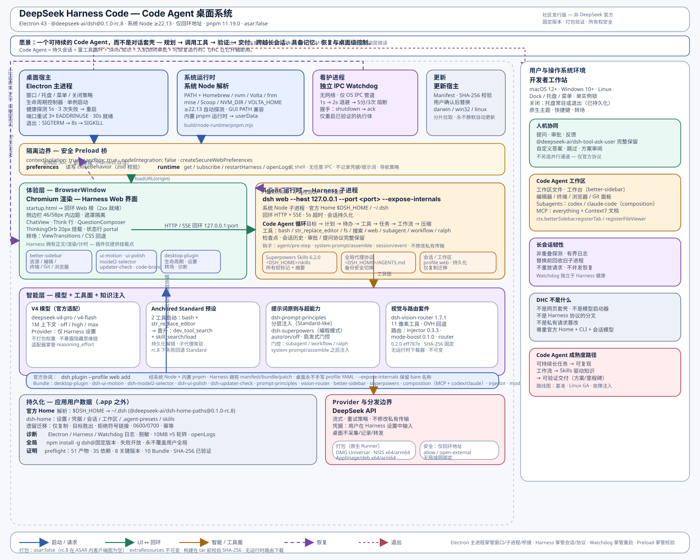

<div align="center">
  
  <h1>DeepSeek Harness Code</h1>
  <h3>可持续的 Code Agent 桌面 — 而非对话套壳。用户不需要自己组装一套脆弱的工具链；官方 Harness 给的是积木，DHC 给的是可安装、可恢复、可长期运行的 Code Agent 系统。</h3>
  <p>DeepSeek Harness Code 把完整 Harness 运行时、官方插件、Skills、工具、Agent 工作流与强化桌面宿主及独立 Watchdog 整合成一个可安装、可恢复、可长期运行的 Code Agent。</p>
  <p><a href="./README.md">English</a> · <a href="./README.zh-CN.md">简体中文</a></p>
  <p><a href="#dhc-的集成理念">集成理念</a> · <a href="#愿景">愿景</a> · <a href="#code-agent-循环">Agent 循环</a> · <a href="#架构">架构</a> · <a href="#不只是网页套壳">为什么不同</a> · <a href="#为长期运行而设计">长期稳定性</a> · <a href="#从源码构建">构建</a></p>
  <p>
    
    
    
    
    
  </p>
  <p>
    
    
    
    
  </p>
</div>

> [!IMPORTANT]
> DeepSeek Harness Code 是一个社区项目，并非 DeepSeek 官方发行版，与 DeepSeek 不存在隶属或关联关系。

## QQ 社区

欢迎加入 DHC 社区 QQ 群，交流使用经验、问题反馈和项目讨论。

- **QQ群号：** `1107534919`

<p>
  
</p>

## DHC 的集成理念

DHC 是 **DeepSeek Harness Code 的桌面版集成包**：提供更完善的桌面端、更现代的支持、更完整的 DeepSeek Harness 与工程能力，以及更完备的 Skills 和用户需求，并将这些能力组装成一个可工作的 Code Agent 应用与工具包。**用户不需要自己组装一套脆弱的工具链**。官方 Harness 给的是积木，DHC 给的是拼好的成品。

本项目明确是 **DeepSeek Harness 的桌面整合包**，不只是 DeepSeek Harness 本身，也不是简单的网页套壳。这个整合包把官方 Harness 运行时与官方能力，和 DHC 新增的 Skills、额外 Skills、插件、工具、工作流、Agent 基础设施、桌面集成、诊断与恢复机制组合在一起。DHC 将这些积木变成一套经过测试、可安装、拥有统一生命周期、能够从启动稳定运行到长期工作的现代化 Agent 应用和工具包。

DHC 仍然是建立在官方 Harness 格式和运行时之上的社区项目。它不打包模型权重，不替代官方 Provider 边界，也不声称自己是 DeepSeek 官方发行版。

---

## 愿景

> **可持续的 Code Agent，而非对话套壳。**

### 为什么“对话”远远不够

浏览器标签页里的 DeepSeek 是一台卓越的对话引擎。但真实的工程不是一问一答完成的：它跨越数小时——阅读代码库、制定计划、触碰二十个文件、运行测试、看到失败、调整方案、交付一个重启后依然可验证的结果。

对话套壳优化的是“下一条消息”。而 Code Agent 必须优化的是“整个任务”——以及那台需要持续存活足够久的机器、会话与进程，去完成这个任务。

常见套壳把最困难的部分留给了用户：

- 浏览器标签页自己管理自己的生命周期——渲染器一卡死，唯一恢复手段是“刷新并丢失上下文”；
- 工具链是散的——Node 版本、pnpm、插件、Skills、提示词都需要手工拼装，每次换系统或升级就断裂；
- Agent 没有持久记忆——会话会蒸发、上下文压缩是随机的、Skills 只是粘贴的提示词片段；
- 失效是静默的——Harness 子进程死了、健康检查重叠了、日志无界增长了，而用户成了监控器。

我们认为这个边界是错的。**桌面应该负责可持续性，Harness 应该负责协议，Agent 应该负责任务。** DHC 正是让这三者在同一个产品边界内相遇的集成点。

### 一个 Code Agent 真正需要什么

Code Agent 不是“模型 + 终端”。它是一个必须被**设计、保活、并可观测**的闭环。从真实的长期会话中，我们提炼出五条必要条件：

**1. 能在行动前先思考的富工具循环。** Agent 需要 Goal → Plan → Todo → Tools → Jobs → Workflow → Compaction → Checkpoint，而不是扁平的工具调用列表。首轮请求尤其关键：若一开始就把 25 个工具全部砸给 V4 Pro，模型会塌缩为浅层的 `Let me...` 轨迹；若只先给 `bash` 与 `str_replace_editor`，则更容易恢复更深的 `We need...` 规划。DHC 的 `anchored-standard` 正是对此的建模——以 2 工具启动，在首次持久化调用后晋升到常驻发现工具，并要求显式的 `dev_tool_search` 才能解锁其余能力。全程不修改私有传输、不提取隐藏思维链。

**2. 可恢复的持久会话。** Agent 的记忆就是它的会话历史、检查点与 Skills。如果承载它的进程可以无声死亡，它就无法被托付给长任务。DHC 每 5 秒非重叠地探测 Harness，连续 3 次失败或子进程退出则串行重启；渲染器持续无响应 30 秒则重建窗口*而不断*健康的 Harness；会话始终落在唯一官方 Home（`$DSH_HOME` → `~/.dsh`）。

**3. 一个工作台，而非输入框。** 真实编码需要文件浏览器、编辑器标签、终端、Git、浏览器——与对话并排。`dsh-better-sidebar` 在 Harness Web 界面内提供类 VS Code 工作台，`dsh-vision-router` 带来 11 个像素工具与 OVH 回退，MCP 桥（everything + Context7）与 `codex`/`claude-code` 子代理则让 Agent 得以分派与验证。

**4. 被安装的知识，而非粘贴的知识。** Skills 不是粘贴的提示词。它们是带版本、由文件系统发现的软件包（`Superpowers 6.2.0`），以所有权标记安装进 `<DSH_HOME>/skills`，加上`全局代理运行协议`（`<DSH_HOME>/AGENTS.md`）——用户没有时自动安装，仅在仍由应用管理且未被修改时才随版本升级。用户自有 Skills 永不被覆盖。

**5. 作为一等协议的人机协同。** Code Agent 必须能提问、被审批、被跳过、被复审。DHC 完整保留官方提问协议（`@deepseek-ai/dsh-tool-ask-user`、`dsh-user-questions`），含稳定 ID、单/多选、自定义答案与方案审阅——绝不另造并行通道。

### DHC 作为 Code Agent 操作系统

合起来看，DHC 更像一个小型的 **Code Agent 操作系统**，而非普通应用：

| 操作系统关切 | DHC 的答案 |
|---|---|
| **进程模型** | Electron 主进程掌管窗口/托盘/生命周期；Harness 以回环子进程运行（`dsh web --host 127.0.0.1 --port <port> --expose-internals`），运行于自动探测的系统 Node（≥22.13）；Watchdog 是独立的仅 IPC 进程，只能重启已验证的执行体。 |
| **包管理** | 固定 `@deepseek-ai/dsh@0.1.0-rc.8` + 8+ 插件，经公开 `dsh plugin --profile web add` + 内置 pnpm 安装；`asar:false` 恢复 39 项客户端启动图；`check-runtime-closure` 在任何打包前校验 51 产物 + SHA-256 路由摘要。 |
| **文件系统** | 唯一官方 Home 经 `@deepseek-ai/dsh-home-paths` 解析；从已退役 Electron 专属 Home 仅复制、目标胜出、拒绝符号链接的迁移；`10MB×5` 脱敏日志轮转；全局 `dsh` 经 `npm install -g`（失败开放，永不覆盖用户全局）。 |
| **安全** | 沙箱渲染器（`contextIsolation`/`sandbox`/`nodeIntegration:false`），仅 `preferences`/`runtime` 两组 preload 能力（zod 校验），仅回环 Harness，`allow`/`open-external` 导航策略。 |
| **界面** | Harness 拥有全部对话绘制；DHC 仅在原生 `role=status` 行内挂载 20px `ThinkingOrb` portal，侧边栏 `46px/58px` 交通灯内边距，路由转场永不强制布局。 |

这正是 DHC 把 Chromium、Harness、插件、Skills 与 Watchdog *都打进 .app*，却运行于*系统* Node 的原因——应用自包含，运行时却是用户已有的官方工具链，即使在 PATH 极小的 GUI 启动场景下也能被自动发现。

### 走向可验证的交付

可持续的 Code Agent 是手段，不是目的。真正的地平线不是“更好的对话”，而是**可验证、可复现的交付**：

- 用户陈述目标。Agent 以 Todo 粒度规划，在审批下使用工具，运行 Jobs 与 Workflow，无损意图地压缩上下文，并交付可重复运行、重复验证的产物。
- Skills 提供可复用、可测试的过程知识，而非一次性提示词。
- 长会话被浸泡测试、基准化、可恢复——不再令人恐惧。

路线图正体现于此：可复现的内存/浸泡基准、原生 Linux GA（AppImage/deb 已在原生 Runner 上 CI 通过）、已锚定工具面的成对验证、非重放的故障注入，以及在固定 `rc.8` + SHA-256 路由不变量背后持续跟进快速演进的上游插件 API。

**DHC 的任务，就是让这个地平线在今天就可安装——一个 Universal DMG、一个 NSIS、一个 AppImage——而不要求用户先成为集成工程师。**

## 一整套 DeepSeek Harness 发行版

这是一套完整、连贯的 Harness 发行版，而不是模型启动器，也不是一堆互不相关的附加组件。官方 Harness Base 与 Web Bundle 已把 DeepSeek Agent 体系中真正有用的部分带进同一个应用：

- **模型与推理**——V4 Pro/V4 Flash 目录、模型选择、Provider 设置、推理强度、重试策略和流式协议处理。
- **Skills 系统**——Skills 运行时、文件系统发现、Skills UI、徽章以及官方 Skill 工具。
- **Agent 工作流**——Standard Preset、系统指令、Goal、Plan 模式、Todo、Jobs、Workflow、上下文压缩、检查点和持久会话。
- **工具能力**——文件读取/搜索/编辑、Bash 与 PowerShell、Web、用户提问、审批、Subagent、反馈和交付物。
- **插件平台**——官方插件清单与设置，以及集成的桌面 Bundle 和 Anchored Standard Bundle。
- **桌面可靠性**——原生生命周期、安全桥接、健康恢复、轮转诊断和独立 Watchdog。

所有能力都以同一个产品边界固定版本、完成打包并接受验证，用户不必再手工拼装脆弱的工具链。

## Code Agent 循环

DHC 不替换 Harness 协议——而是让协议**足够可持续**，以承载真实工作。每个会话内运行的循环是：

```
目标 → 计划 → 待办 → 工具（bash · edit · search · web · subagent）
        ↕            ↕
     用户提问    任务 / 工作流 / 压缩 / 检查点
        ↕            ↕
       审批     会话持久化 + Skills 知识
```

- **启动：** `system-prompt/assemble` 只暴露 `bash` + `str_replace_editor`。`agent/pre-step` 仅在启动期过滤自动的 `agent-instructions`/`skill-catalog`。
- **晋升：** 首次持久化工具调用或助手消息 → Minimal + `dev_tool_search`/`skill_search`/`skill_load`。其余工具仅在显式 `dev_tool_search` 解锁并被持久会话事件记录后出现。
- **韧性：** 压缩开启一个受控工作集的新纪元；子代理常驻启动；缺失阶段所需工具会让该预设直接失败，而非静默回退到全量——因此 Standard 始终可用。

这个循环正是桌面宿主存在的理由：那个规划了 45 分钟的会话，必须在一次渲染器重建或一次 Harness 重启后**依然在那里**。宿主保证这一点；Provider 保证智能。

## 让 BETA1 体验更加现代化

DeepSeek Harness BETA1 提供了基础，但早期以 Web 为中心的开发体验仍把一些重要的产品问题留给用户自行处理。DeepSeek Harness Code 围绕这个基础构建现代化应用层，并重点治理在真实、长期使用中最明显的问题：

- **长会话内存压力**——限制桌面侧已知增长路径、轮转诊断、防止恢复任务重叠，并回收已经被替代的进程。
- **Web 界面卡死**——检测持续无响应的渲染器，在不销毁健康 Harness 服务的前提下替换窗口。
- **脆弱的进程生命周期**——完整管理启动、就绪、串行重启、有界退出、端口重试和会话感知恢复。
- **能力分散**——把运行时、插件、Skills、工具、工作流、提问、审批和桌面扩展打包成一套经过测试的产品。
- **桌面体验缺口**——补充原生菜单、托盘行为、关闭偏好、系统外观、快捷键、转场、设置与可访问诊断。

我们的目标不是把 Harness 分叉成一套竞争协议，而是在保留官方 Harness 模型的同时，让整套体验更加完整、现代、可靠，真正适合日常使用。

## 更完整地使用 V4 Pro

V4 Pro 是这套整合基础所增强的重要能力之一，而不是产品的唯一中心。当前固定的官方 Harness 适配器已经把 `deepseek-v4-pro` 与 `deepseek-v4-flash` 同时提供给模型选择器，公布 1,000,000 Token 上下文目录，并支持 `off`、`high`、`max` 三档推理强度。V4 Flash 继续承担快速、经济的任务；V4 Pro 则可以用于高强度规划、架构、调试和长周期编码工作。

应用打包的是完整集成与运行时，而不是模型权重。Provider 凭据继续保存在官方 Harness 设置中，请求继续经过官方 DeepSeek Provider 边界。

### V4 Pro 的工具面锚定

下一步增强 V4 Pro 的方向，不是通过某个关键词“打开推理”，而是控制
首轮请求可见的工具面，在完整 Harness 工具目录出现之前，先保住 V4 Pro
本来能够产生的高质量推理轨迹。

DeepSeek V4 Pro 正式版发布后，因实际表现不及灰度测试预期而引发社区
争议。开源社区随后通过消融实验发现，V4 Pro 对首轮请求中 API 可见的
工具目录（**Schema Surface**）高度敏感：

- 在 **Standard** 模式下，25 个工具一开始全部可见。V4 Pro 容易陷入
  低效的 `Let me...` 轨迹，Project2 得分约为 **9,192**。
- 在 **Minimal** 模式下，只提供 Shell 和 Read 两项工具。模型更容易
  恢复灰测时期的 `We need...` 轨迹，Project2 得分回升至约 **9,699**。

`dsh-anchored-standard` 采用**“首轮锚定 + 动态晋升”**来解决这个取舍：
首轮只暴露两项核心工具以锚定推理轨迹；模型发起首次持久化 Tool Call
后，立即在后续轮次解锁完整的 25 项 Standard 工具。这样既保留高级工具，
又避免让首轮 Schema 承担完整 Standard 目录的干扰。在 Windows 原生
Project2 测试中，该方案连续跑出 **98** 和 **99** 的成绩，进入前沿模型
的分数带。

当前工作假设是：V4 Pro 的核心能力并未消失，而是可能在强化学习（RL）
后训练阶段，对特定 Harness 脚手架与工具暴露环境产生了显著过拟合。因此，
本项目把 V4 Pro 视为更大范围 Harness 现代化中的重要能力：保留官方运行时
和 Provider 边界，改善模型周围的工具环境，同时不暴露隐藏思维链，也不修改
私有请求字段。

> [!NOTE]
> V4 Pro 模型选择以及官方 `off` / `high` / `max` 推理控制已经存在于当前固定的 Harness 运行时中。工具面锚定是独立的集成能力：它改变会话不同阶段所暴露的工具目录，而不是修改模型私有字段；它不会暴露隐藏思维链，也不会替代官方 Provider 边界。

## 不只是网页套壳

许多桌面客户端做到把远程网页加载进 Electron 或 WebView 就停止了。它们可以提供 Dock 或任务栏图标，却仍然把生命周期、故障、内存压力和诊断责任全部留给那个网页。

DeepSeek Harness Code 选择了另一条路线：

| 能力         | 普通网页套壳             | DeepSeek Harness Code                                                                                                              |
| ------------ | ------------------------ | ---------------------------------------------------------------------------------------------------------------------------------- |
| 运行时       | 加载已有远程页面         | 内置 Chromium、官方 Harness 运行时与集成插件；运行于系统官方 Node.js（自动探测）                                                   |
| 模型集成     | 继承网页当时提供的模型   | 一等 V4 Pro/Flash 目录与官方推理强度控制                                                                                           |
| Agent 工具链 | 没有集成式工具链         | Harness 插件、Skills、工具、Goal、Plan、Workflow、提问与 Subagent                                                                  |
| 进程所有权   | 页面本身就是产品         | 桌面宿主管理 Harness 启动、就绪、重启与退出                                                                                        |
| 长会话健康   | 依赖用户手动刷新         | 非重叠健康探测与基于证据的恢复机制                                                                                                 |
| Web 界面卡死 | 关闭或重载整个应用       | 检测无响应渲染器，在保留健康 Harness 状态的同时重建窗口                                                                            |
| 服务失效     | 界面停止后用户才发现     | 连续探测失败或子进程退出后自动恢复                                                                                                 |
| 桌面进程崩溃 | 没有独立恢复层           | IPC-only Watchdog、有界退避与崩溃循环保护                                                                                          |
| 内存压力     | 继承网页和进程的无界行为 | 限制已知增长路径、轮转日志、回收失效进程、隔离渲染器恢复                                                                           |
| 诊断         | 最多只有浏览器控制台     | 经脱敏的 Electron、Harness、Watchdog 日志，可在应用内打开                                                                          |
| 桌面集成     | 只有窗口外壳             | 原生托盘/菜单、关闭策略、系统主题、快捷键与会话感知恢复                                                                            |
| 安全边界     | 常见宽权限 preload       | 仅回环地址 Harness 与两组经过验证的 preload 能力                                                                                   |
| 分发         | 依赖外部网站或运行环境   | 自包含应用，运行于系统官方 Node.js：自动探测常见安装位置（nodejs.org 安装器、Homebrew、nvm、Volta、fnm、mise、nvm-windows、Scoop） |

我们尊重轻量套壳的价值：它们解决的是“像应用一样打开这个网页”。DeepSeek Harness Code 解决的是另一个问题：**把 Harness 作为一个有韧性的桌面编码系统来运行。**

## 为长期运行而设计

长期运行的 Web 应用很少只以一种戏剧性的方式失效。更多时候，压力会逐渐累积：渲染器失去响应、子进程退出、健康检查重叠、日志无限增长，或者已经失效的进程仍被活着的窗口占用。

DeepSeek Harness Code 使用明确的生命周期控制覆盖这些已知失效路径：

- **Harness 健康监测**——宿主每五秒只执行一个探测。连续三次失败或当前子进程退出会触发串行恢复。
- **渲染器卡死恢复**——渲染器必须持续无响应 30 秒才会重建窗口；恢复响应会取消操作，健康的 Harness 进程保持运行。
- **独立 Watchdog**——桌面进程异常断开后采用一秒、两秒的有界重启延迟；五分钟内第三次崩溃会打开熔断器，而不是进入无限重启。
- **有界退出**——正常退出会与 Watchdog 协调，先要求 Harness 优雅终止，最多等待八秒，然后才升级处理。
- **有界诊断**——日志经过脱敏，并轮转为五个 10 MB 文件，而不是永久增长。
- **恢复不重叠**——并发故障统一收敛到一次恢复操作，避免重启风暴和重复子进程。
- **不盲目重放请求**——健康服务不会被误杀，被中断的模型请求也不会被自动重新发送。

### 内存压力治理

原始 Web 体验在长时间使用后可能变得越来越沉重。本项目通过以下机制控制桌面侧已知的长期内存压力来源：

1. 替换已经失效的渲染器，避免永久无响应的窗口继续常驻；
2. 在启动替代进程前先回收旧 Harness 子进程；
3. 防止健康探测和恢复链并发重叠；
4. 通过日志轮转限制诊断数据增长；
5. 强制执行干净且有界的退出，避免孤儿进程在多次启动间累积。

这些是已经实现的控制机制，而不是“内存降低 X%”的合成宣传。可复现的跨平台内存基准仍属于路线图。具体证据见[生命周期契约](./docs/architecture/lifecycle.md)和[验收报告](./docs/engineering/acceptance-report.md)。

## 现代化桌面体验

- **自包含宿主、系统 Node.js**——Chromium、Harness、插件和 Watchdog 放在应用包内。应用直接使用系统安装的官方 Node.js（22.13 及以上，无上限），首次启动把固定的 Harness 依赖安装到应用自有用户数据目录；自动探测常见安装位置，包括 GUI 启动时 PATH 不含 Node 的场景。
- **官方 Harness 体验**——会话、Profile、Provider、工作区行为与提问流程继续使用官方 Harness 模型。
- **集成设置**——运行状态、重启、日志、关闭行为和实验模式控制 live 在 General 设置 using 官方 Harness UI 原语.
- **原生生命周期**——通过常驻托盘/菜单打开应用、重启 Harness、打开日志或退出；可选择关闭到托盘或直接退出。
- **系统级外观**——跟随浅色/深色系统主题的启动页、平台标题栏处理、官方单色资产和减少动画支持。
- **平滑导航**——可用时采用 View Transitions，否则使用低开销 CSS 回退完成路由提交转场。
- **工作区韧性**——已验证 Standard 工作区切换和官方会话恢复。
- **内置 Skills 基础**——启动时将 Superpowers 6.2.0 安装到官方 `<DSH_HOME>/skills` 根目录；同名用户自建 Skill 目录绝不会被覆盖。
- **内置全局 Agent 提示词**——随包携带经过评审的《全局代理运行协议》并安装为 `<DSH_HOME>/AGENTS.md`：用户没有全局提示词时自动安装；仅在副本仍由应用管理且未被修改时随版本更新；绝不覆盖用户自有的提示词。菜单中的「Use Bundled Global Prompt…」可将现有提示词一键切换为内置版（自动生成带时间戳的备份）。
- **全局 `dsh` 命令**——首次启动即通过官方 `npm install -g` 流程安装本应用固定版本的 `@deepseek-ai/dsh`，此后在任何新终端里都能直接使用 `dsh`，与官方 CLI 安装体验完全一致。用户自有的全局 `dsh` 绝不会被覆盖；供给失败不阻塞启动，仅提示一行手动安装命令。
- **本地化 Agent Preset**——`anchored-standard`、`router-standard`、`router-spec` 均提供简短的中英双语名称与描述，且不改变 Preset ID 或路由行为。
- **安全的实验集成**——Anchored Standard 是独立的官方格式 Bundle；在固定的 Harness rc.8 API 上会安全回退到 Standard。

## 功能矩阵

| 领域           | 已包含能力                                                                         |
| -------------- | ---------------------------------------------------------------------------------- |
| 桌面宿主       | 强化 Electron 窗口、启动页、原生菜单、托盘、关闭偏好                               |
| Harness 运行时 | 固定 `@deepseek-ai/dsh` rc.8、仅回环地址 Web 服务、官方单一 Harness Home           |
| V4 模型        | 官方 V4 Pro/Flash 目录与 `off` / `high` / `max` 推理控制                           |
| 一体化能力栈   | Skills、工具、Goal、Plan、Workflow、Todo、Jobs、提问、审批与 Subagent              |
| 内置 Skills    | Superpowers 6.2.0 合集安装进官方 Harness Home，不覆盖用户 Skills                   |
| 全局提示词     | 内置 `AGENTS.md` 运行协议：所有权安全安装 + 带备份的菜单一键切换                   |
| 全局 CLI       | 首次启动经官方 `npm install -g` 流程安装固定版本的 `dsh` 命令                      |
| Agent Preset   | Standard 保持默认；可选 `anchored-standard` 与受管 `router-standard`/`router-spec` |
| 恢复           | 健康探测、进程重启、渲染器替换、端口重试、会话恢复                                 |
| Watchdog       | 独立 IPC 进程、有界重启策略、持久化崩溃循环标记                                    |
| 插件           | 桌面设置/转场 Bundle、Anchored Standard Bundle 与自动装载的路由套件                |
| 诊断           | 启动证据、运行状态、脱敏轮转日志、打开日志操作                                     |
| 安全           | 沙箱渲染器、禁用 Node 集成、验证 IPC、导航策略                                     |
| 打包           | macOS Universal DMG；Windows NSIS 与 Linux AppImage/deb 配置                       |

## 路由套件

DeepSeek Harness Code 内置社区 [dsh-routing-suite](https://github.com/yjh051108/dsh-routing-suite)，并在每次启动时自动装载：

- **离线快照** —— 安装包内置套件三个组件的固定版本快照（@dsh-external/dsh-super-injector Bundle 层、@dsh-external/dsh-mode-boost 宿主增强、router-standard 与 router-spec 智能体预设），存放在应用资源目录中。
- **固定基线** —— 内置快照记录 injector `0.3.3`、mode-boost `0.1.0`、路由预设 `0.2.0`（commit `eff787e95132d6c7104214542104a84d656b497e`），SHA-256 摘要保存在 `build/routing-suite/versions.json`。
- **官方安装** —— 启动时桌面宿主使用应用内置 pnpm 运行公开的 `dsh plugin --profile web add` 流程，安装桌面 Bundle、`dsh-ui-motion`、`dsh-model2-selector`、`dsh-prompt-principles`（分层提示词原则注入，含插件区专属设置页）、`dsh-vision-router`、`dsh-better-sidebar`、应用组合 Bundle（MCP 桥接 everything 测试服务与 Context7 文档，以及官方 Codex / Claude Code subagent 提供方——经插件自带 bundle patch 下发，绝不触碰用户的 profile 补丁层）、Super Injector、Mode Boost 与 `dsh-find-plugin`。Profile 清单、依赖位置、Bundle 列表和补丁加载均由 Harness 管理；桌面宿主只在该 CLI 之外管理路由预设与 Skills。调和若因派生 `node_modules` 损坏（如自引用符号链接）失败，会自动清除该派生产物并整体重试一次。
- **审核后更新** —— 路由组件只随经过审核的新 App 版本更新。构建在解压前校验每个固定归档的精确 SHA-256；安装后的 App 不会在后台下载或执行可变的路由代码。
- **容错** —— 任何装配失败都不影响 Standard Harness 启动，并只报告有限诊断；用户自建的同名预设不会被覆盖。

## 架构

<p align="center">
  
  <br />
  <em>图 1 — Code Agent 桌面架构。Electron 主进程掌管窗口/子进程/桥接；Harness 掌管会话/协议；Watchdog 掌管重启；Preload 掌管校验。详见<a href="./docs/architecture/overview.md">系统概览</a>与<a href="./docs/architecture/lifecycle.md">生命周期设计</a>。English version: <a href="./docs/architecture/system.svg">system.svg</a></em>
</p>

一图读懂 Code Agent 架构：

- **桌面宿主**（Electron 主进程）创建窗口、解析系统 Node、经公开 CLI 协调插件、在回环端口启动 `dsh web`，并以 5s 非重叠探测进行健康检查。
- **Preload 桥**是渲染器↔主进程的唯一缝隙——仅两组能力（`preferences`、`runtime`），zod 校验，无 shell 与任意 IPC，沙箱渲染器。
- **BrowserWindow** 承载官方 Harness Web 界面（对话、侧边栏 46/58px 内边距、ThinkingOrb 挂载）与工作台（`better-sidebar`）及打磨层。
- **Harness 子进程**运行完整 Agent 运行时（Goal/Plan/Todo/Jobs/Workflow，会话持久化，压缩与检查点），于 `127.0.0.1` 官方 Home 之下。
- **智能层**塑造模型所见：V4 Pro/Flash 适配、已锚定工具面、分层提示词、Superpowers 编程门控、视觉链与不可变路由套件（injector/mode-boost/router-preset，均 SHA-256 固定）。
- **Watchdog** 经 OS IPC 管道观察主进程，以有界退避（1s → 2s → 熔断）重启——独立于 Harness 健康。
- **持久化**始终在 `.app` 之外——`$DSH_HOME` 或 `~/.dsh`，含 `10MB×5` 脱敏日志与所有权安全的 Skills/预设/AGENTS.md。

Electron 主进程负责窗口、本地 Harness 子进程、就绪检查和窄权限 preload 桥接。Harness 仅绑定 `127.0.0.1`，并把会话保存在官方 Home（显式 `$DSH_HOME` 或默认 `~/.dsh`）。官方格式 Bundle 由 Harness 公开插件 CLI 协调安装，并在不替换协议的情况下扩展 Web 客户端。独立 Watchdog 不开放网络监听，并且只能重新启动经过验证的应用命令。

完整边界请阅读[系统概览](./docs/architecture/overview.md)和[生命周期设计](./docs/architecture/lifecycle.md)。亮/暗主题自动适配；`system.svg` 为英文镜像。

## 安全模型

- 启用渲染器沙箱，禁用 Node 集成。
- 公开 preload API 仅包含 `preferences` 和 `runtime` 两组能力。
- IPC 载荷必须通过验证才能触发桌面操作。
- Harness 仅绑定回环地址，不暴露到局域网。
- 凭据只进入官方 Harness 设置，绝不写入应用包。
- 日志排除凭据、Authorization Header、Cookie、Prompt 和响应正文。
- 外部导航遵循明确的允许/外部打开策略。

实验性 Anchored Standard 设置不会拦截私有模型流量，也不声称能够控制隐藏思维链。

## 平台状态

| 平台    | 目标                              | 当前状态                                                           |
| ------- | --------------------------------- | ------------------------------------------------------------------ |
| macOS   | macOS 12+，Intel 与 Apple Silicon | Universal 应用与未签名/ad-hoc 签名 DMG 已验证，随 0.1.0-BETA1 发布 |
| Windows | Windows 10+，x64 与 arm64         | 原生 NSIS 安装包在 Windows Runner 构建，随 0.1.0-BETA1 发布        |
| Linux   | x64 与 arm64                      | AppImage/deb 已在 Linux Runner 构建通过，将在后续版本随包发布      |

跨平台配置已经进入仓库，只有经过对应原生 Runner 构建与验证的产物才会被视为正式发行。首个公开预览版为 **DeepSeek Harness Code（DHSC）0.1.0-BETA1**——该版本覆盖 macOS 与 Windows；Linux 云端 CI 现已通过，可在后续版本提供 Linux 安装包。

## 在 macOS 上安装

当前 macOS 安装包没有 Apple 签名。把 `DeepSeek Harness Code.app` 复制到 `/Applications` 后，信任该构建的用户可以只移除此应用的隔离属性：

```bash
xattr -dr com.apple.quarantine "/Applications/DeepSeek Harness Code.app"
```

不要在系统范围内禁用 Gatekeeper。安装社区构建前请阅读[完整的未签名安装指南](./docs/operations/install-unsigned.md)。

## 从源码构建

### 环境要求

- Node.js 22.13 及以上（构建工具链与应用运行时要求）
- pnpm 11.19.0（通过下方固定命令调用）
- 目标操作系统对应的原生打包工具

```bash
git clone https://github.com/Code-DSH/deepseek-harness-code.git
cd deepseek-harness-code
npm exec --yes --package=pnpm@11.19.0 -- pnpm install --frozen-lockfile
npm exec --yes --package=pnpm@11.19.0 -- pnpm test
```

构建并启动桌面应用：

```bash
npm exec --yes --package=pnpm@11.19.0 -- pnpm start
```

创建原生安装包：

```bash
npm exec --yes --package=pnpm@11.19.0 -- pnpm dist:mac
npm exec --yes --package=pnpm@11.19.0 -- pnpm dist:win
npm exec --yes --package=pnpm@11.19.0 -- pnpm dist:linux
```

> 发布安装包由 GitHub Actions 在推送 `v*` 标签时自动在云端构建。本地的 `dist:*` 命令仅用于本地验证，不会发布产物。

## 验证

```bash
# 先构建：单元闭包契约与打包运行时套件依赖生成产物（dist/**、build/routing-suite）
npm exec --yes --package=pnpm@11.19.0 -- pnpm build

# 单元、插件、打包契约和浏览器测试
npm exec --yes --package=pnpm@11.19.0 -- pnpm test

# 一条命令完成全部结构化门禁（类型、Lint、格式、文档、安全）
npm exec --yes --package=pnpm@11.19.0 -- pnpm check

# 内存门禁：受限堆运行单元套件并检查峰值 RSS
npm exec --yes --package=pnpm@11.19.0 -- pnpm check:memory

# 类型、Lint、格式、文档和安全契约
npm exec --yes --package=pnpm@11.19.0 -- pnpm typecheck
npm exec --yes --package=pnpm@11.19.0 -- pnpm lint
npm exec --yes --package=pnpm@11.19.0 -- pnpm format:check
npm exec --yes --package=pnpm@11.19.0 -- pnpm verify:docs
npm exec --yes --package=pnpm@11.19.0 -- pnpm verify:security

# Universal macOS 产物检查
node scripts/verify-macos-artifact.mjs \
  release/DeepSeek-Harness-Code-0.1.0-BETA1-mac-universal.dmg --universal
```

## 文档

- [项目意图](./docs/project/intent.md)
- [架构概览](./docs/architecture/overview.md) — 进程边界、智能层、插件清单
- [生命周期与恢复](./docs/architecture/lifecycle.md) — 启动、健康、Watchdog、退出
- [架构图（中文）](./docs/architecture/system-zh.svg) · [Architecture (EN)](./docs/architecture/system.svg)
- [测试策略](./docs/engineering/testing.md)
- [验收证据](./docs/engineering/acceptance-report.md)
- [故障排除](./docs/operations/troubleshooting.md)
- [未签名 macOS 安装](./docs/operations/install-unsigned.md)

## 路线图 — 走向可验证的 Code Agent

- **可复现的韧性基准**——发布跨平台内存/浸泡指标，以已实现的 5s 探测 / 30s 渲染器 / 8s 退出契约作为基线。
- **原生 Linux GA**——AppImage/deb 已在原生 Runner 上 CI 通过；BETA1 之后的首个 GA 版本将包含它们。
- **已锚定工具面验证**——完成成对 Project2 级验证（Standard vs anchored，各 ≥10 次，仅 schema 哈希/分数/方差）以验证首轮锚定 + 动态晋升路径。
- **故障注入深度**——在不重放请求、不削弱沙箱/回环/Watchdog 边界的前提下扩展渲染器/Harness/Watchdog 注入。
- **Skills 驱动交付**——将 Superpowers + 提示词原则 + 路由预设作为可版本化、可测试的过程知识持续增长，而非一次性提示词。
- **上游跟进**——在固定 `rc.8` + SHA-256 路由不变量背后持续跟进快速演进的上游插件 API；永不静默下载路由。

## 参与贡献

欢迎提交 Issue 和 Pull Request。运行时行为变更应包含针对性测试，并更新相应的规范文档。公开说明必须以证据为基础；请勿附加 Provider Key、Cookie、原始 Prompt、响应正文或未脱敏诊断日志。

建议从 [AGENTS.md](./AGENTS.md)、[文档索引](./docs/index.md)以及最接近目标行为的现有测试开始。

## 许可证

DeepSeek Harness Code 采用 MIT License 发布。

## 致谢

本项目建立在官方 [DeepSeek Harness](https://github.com/deepseek-ai/deepseek-harness) 运行时和开源 Electron 生态之上。DeepSeek 及其维护者创造了基础；本社区项目专注于桌面生命周期、集成、恢复、打包与长期 Code Agent 可用性。

## 免责声明

DeepSeek Harness Code 是社区维护的软件。“DeepSeek”仅用于说明与上游项目和服务的兼容性，不代表 DeepSeek 对本项目存在关联、认可、担保或官方支持。
