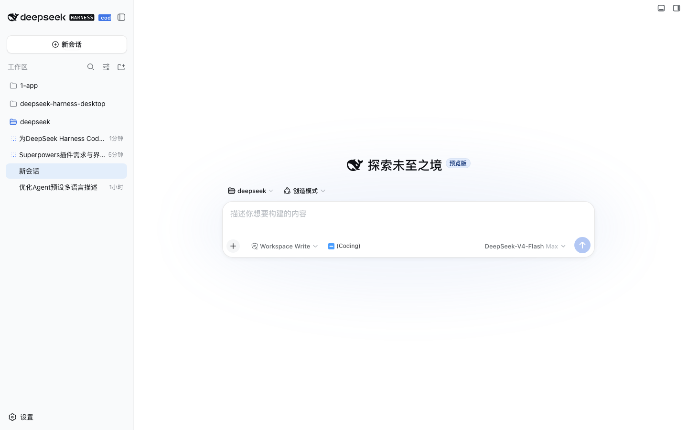

# dsh-code-brand

> DeepSeek Harness Code 品牌标识插件 —— 在左上角 DeepSeek Harness 品牌 lockup 中、**HARNESS 徽标右侧**追加一枚蓝色小字 **`code`**，作为「Code 整合包」的身份标识。



## 效果

- 位置：左上角品牌行，位于 `HARNESS` 徽标与收起侧边栏按钮之间。
- 对齐（按需求）：`code` 盒子左右两侧与 `HARNESS` 右边界、收起按钮左边界保持等距；垂直中心与 HARNESS 徽标中心对齐。
- 样式：与 HARNESS 徽标同款的蓝色圆角徽标 —— 蓝色底（亮色 `#4176e6`，暗色 `#4a7cf0`）+ **白色 `code` 字**，圆角 2px、无图标、字号小（11px / 600）。
- 纯装饰：`pointer-events: none`，绝对定位注入，**零布局影响**。

## 实现方式

纯注入式 UI 插件，**不修改任何官方文件**：

- `lib/client.js`：在官方品牌 wordmark svg（兼容 `svg[viewBox="0 0 182 24"]` 与 rc.8 起的侧栏文字版 `svg[viewBox="26 0 156 24"]`）内定位 HARNESS 徽标矩形（`w=52, h=14, rx=2, x=129.348, y=5.5`），并定位同一 `logoRow` 中的收起侧边栏按钮。插件读取两者的**实时屏幕坐标**，用等距公式将 `code` 放在两者正中；`ResizeObserver`、`MutationObserver`、窗口变化与过渡事件会触发重算，因此侧栏宽度、收起/展开和缩放不会造成漂移。插件卸载/更新时自动移除 span、断开 observer。
- `lib/index.js` / `index.js`：Host 侧空实现，仅激活 loader 行。
- `cordis.patch.yml`：bundle loader 行（裸包名，供 client-modules 注册表解析并托管 `lib/client.js`）。

## 安装 / 卸载

### 持久安装（推荐，重启后仍生效）

```bash
dsh plugin install /Users/trip/TRUE 开发/deepseek/dsh-code-brand
```

或通过注入器工具：

- `dev_install_package`：热装配 + 持久（改 profile `web` 的 `dependencies`/`bundles`）。
- `dev_inject_plugin`：仅运行时注入（记录在 super-injector registry，自愈恢复）。

改代码后热更新：`dev_reload_package`（match `dsh-code-brand`）。

### 卸载

- `dev_uninject_plugin`（match `dsh-code-brand`），或删除 profile `package.json` 中对应 `link:` 依赖与 `bundles` 数组项后重启。

## 打包进 DeepSeek Harness Code 发行版

把插件目录复制进应用资源目录（如 `Resources/dsh-code-brand/`），并在桌面版装配清单（profile `bundles` / 发行脚本）中加入包名 `dsh-code-brand`，与 `dsh-ui-motion`、`desktop-plugin` 等一致即可随应用分发。

## 调整外观

样式集中在 `lib/client.js`：

- 左右间距：由 `equalGapLeft()` 根据 HARNESS 右边界、收起按钮左边界和 `code` 宽度实时计算，不使用固定像素。
- 垂直对齐：由 `centeredTop()` 按 HARNESS 实时盒子的垂直中心计算。
- 底色：`.dshc-code` 的 `background`（亮色 `#4176e6` / 暗色 `#4a7cf0`）。
- 字号：`.dshc-code` 的 `font-size`（当前 11px）。

## License

BSD-3-Clause
